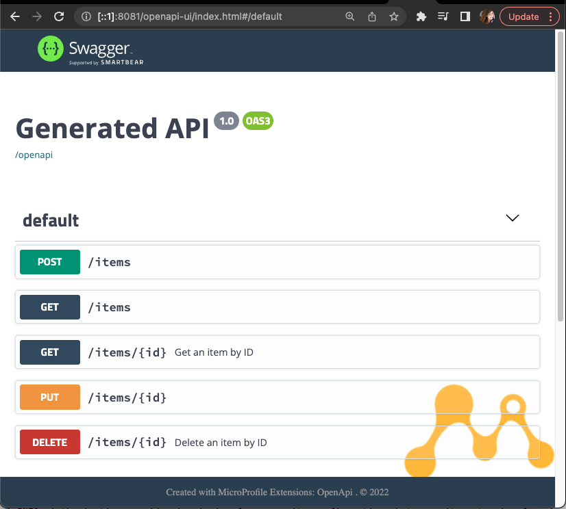

# Creating a client service with MicroProfile RestClient 

## Introduction

### What you will learn

Here are the main goals you will achieve with this hands-on execise:

* Learn the configuration required in a Helidon service to allow it to consume an external endpoints.
* With JAX-RS service, execute five different operations through an external service:
  * List all
  * Find by ID
  * Insert
  * Update 
  * Delete

### Use Case

For this scenario, you will use an existing JAX-RS service, the **restaurant** **service**. You will create a client application that can consume all the RESTful APIs available in the **restaurant** **service**. 

You will start with an existing service with a foundation that will support the development of your client application. Your task is to finish the service, as all the RestClient configuration and implementation is missing.Make sure your service can properly interact with the [restaurant service](https://github.com/architects4j/helidon-microstream-training-labs-foundation/tree/main/restaurant).

## Pre requisites

To be able to go through this guided exercise, you will need to have the following components in your dev environment:

* Have finished the steps described in [Preparing your environment](00_environment.md)

## Hands-on practice

For this scenario, you should create a client service that consumes an existing JAX-RS service: the `restaurant service` . 

You will enhance a partially written `restaurant client service` to allow it to integrate with the following `restaurant service` APIs: 

| Method      | Path              | Description                                 |
| ----------- | ------------      | ------------------------------------------- |
| `GET`       | /restaurants      | :material-check:  Fetch all the items       |
| `GET`       | /restaurants/{id} | :material-check:        Fetch an item by ID |
| `POST`      | /restaurants      | :material-check-all:      Insert new items  |
| `PUT`       | /restaurants/{id} | :material-check-all:           Update items |
| `DELETE`    | /restaurants/{id} | :material-close:               Delete items |

The client service is partially written and you are the one responsible for creating all the RestClient configuration and implementation that are missing. Your task is to finish this application and make sure you can interact with the [restaurant service](https://github.com/architects4j/helidon-microstream-training-labs-foundation/tree/main/restaurant).

### Understanding the services

#### The restaurant service 

The `restaurant service` provides RESTful APIs that allow managing the items that are currently needed by the restaurant. An item has the following structure:

```json
{
  "name": "water", 
  "description": "Water appears as a clear, nontoxic liquid composed of hydrogen and oxygen, essential for life.", 
  "type": "BEVERAGE", 
  "expires": "2025-12-03", 
  "ingredients": [{"name": "water", "unit": "L", "quantity": 2}]
}
```

Since our application needs to integrate with this service, after the implementation is finished, a practical test will require both services to be up running in our environment. 

In the `restaurant service`, check the class `RestaurantController`. These are the endpoints your client service should consume.

Next, let's check the existing code for the client service and start coding.

#### The restaurant client service

1. Locate and open with your IDE of choice the project `helidon-microstream-training-labs-foundation/restaurant-client-lab`. 

2. Open the `pom.xml` and check your project has the following dependency: 
```xml
<dependency>
    <groupId>org.microprofile-ext.openapi-ext</groupId>
    <artifactId>openapi-ui</artifactId>
    <version>1.1.5</version>
</dependency>
```
   This is the [MP OpenAPI-UI extension](https://github.com/microprofile-extensions/openapi-ext/tree/main/openapi-ui). It will allow you to use your browser to interact with the REST APIs you are about to create. Once you are finished, you will see something like this:

    

Let's get started with the integration of our **restaurant client service** and the **restaurant service** using MicroProfile RESTClient.

### Integrating through MicroProfile RESTClient

In order to consume a service using RESTClient, we will:

- Create an `interface` that will match the service operations we want to be able to invoke;
- Set up the appropriate annotations to configure this `interface` as a rest client;
- Add to the `application properties` a reference to the external service that will be consumed by the rest client; 

#### Creating the RESTClient interface

1. Open the `restaurant-client-lab` in your IDE.
2. Locate and open the `RestaurantService` interface. 

    This is the interface we'll use as a RestClient to consume the external API exposed by [Restaurant Controller](https://github.com/architects4j/helidon-microstream-training-labs-foundation/blob/main/restaurant/src/main/java/org/a4j/restaurant/RestaurantController.java) part of the `restaurant-service`.

3. Configure this `interface` as a RESTClient by adding, before the interface's name, the annotations `@Path("restaurants")` and `@RegisterRestClient` . It will look like this:
```java
@Path("restaurants")
@RegisterRestClient
public interface RestaurantService {
```

4. The next step is to create the contract of the methods you will consume on the external service. 
    
    As a first example, let's check the insert operation. The [`RestaurantController`](https://github.com/architects4j/helidon-microstream-training-labs-foundation/blob/main/restaurant/src/main/java/org/a4j/restaurant/RestaurantController.java) _(part of the  `restaurant-service`)_, has the following method:
```java
    @POST
    public Response insert(@Valid Item item) {
        return Response.status(Response.Status.CREATED)
        .entity(repository.save(item))
        .build();
    }
```
   In order to invoke the endpoint exposed by this method, create the following method declaration in your **`RestaurantService` Interface**:
   ```java
   @POST
   public Response insert(Item item);
   ```

    !!! success "Awesome!"
        You've just created the first integration between your client and the external service! It's as easy as that!


5. Now, implement the other four method declarations in the `RestaurantService` interface. 

    Make sure you have all five methods of the external service: `findById`, `insert`, `update`, `delete` and `getAll`. 

#### Configuring the RestaurantService endpoint

The next step is to create a MicroProfile configuration property, where the property's `name` is the RESTClient interface FQDN, and the `value` is the external service URL.

- Add the following property in `resources/META-INF/microprofile-config.properties`:

   ```properties
   org.a4j.restaurant.client.RestaurantService/mp-rest/url=http://localhost:8080/
   ```
!!! success "Good job"
    The client configuration is now done. You've learned that when using RESTClient, the integration is done with really few code. The contract goes within the interface and all configuration within the `microprofile-config.properties` file. 

### Testing the service

To test this service you need to run two applications, the `restaurant-service` and the `restaurant-client-service`. Each service will run in a different port.

#### Starting the restaurant service

To start the restaurant service locally, follow these steps:

1. Open the terminal;
2. Access the foundation project directory, e.g.:
```shell
cd $YOUR_CUSTOM_DIR/helidon-microstream-training-labs-foundation/restaurant
```
3. Package and run the service:
```shell
mvn clean package 
java -jar target/restaurant.jar
```
3. Use your browser to confirm the service is up and running at:

    - Restaurant service: [http://localhost:8080/]()

    !!! attention "About the restaurant service persistence"
        For this lab's learning purpose a database persistence is not required. The service uses an [in-memory list](https://github.com/architects4j/helidon-microstream-training-labs-foundation/blob/main/restaurant/src/main/java/org/a4j/restaurant/RestaurantRepositoryMemory.java) to store and retrieve data. 
 
        To simplify the lab it is also initialized with two items in the list : "Water" and "Juice".

Now, let's package and run our client.

#### Starting the restaurant client service

3. On a different terminal tab, access the service directory. e.g.
```shell
cd $YOUR_CUSTOM_DIR/helidon-microstream-training-labs-foundation/restaurant-client-lab
```
3. Package and run the service:
```shell
mvn clean package pom.xml 
java -jar target/restaurant-client-lab.jar
```

3. Use your browser to confirm the service is up and running at
    - Restaurant client service: [http://localhost:8081/]()


#### Testing the restaurant client service

4. Your client includes the microprofile extension ui for OpenAPI. To access the ui, open:

    - Client OpenAPI UI: [http://localhost:8081/openapi-ui](http://localhost:8081/openapi-ui).

5. Select the **GET /items** endpoint, click on "**try it out**" button, and then on the "**Execute**" blue button.

    You should get an `HTTP 200` response and a list with two items.

    

6. Now, use your client service API to delete the "**juice**" item. In your browser, locate the [DELETE items endpoint](http://localhost:8081/openapi-ui/index.html#/default/delete_items__id_) and click on **"Try it out"**.

7. Type `juice` in the `Id` field and click on the **Execute** button.  
   

8. Finally, confirm that the item was deleted and is not retrieved with the [GET items endpoint](http://localhost:8081/openapi-ui/index.html#/default/get_items) endpoint. The response should be an `HTTP 200` and `juice` should not be in the list.
```json
[
  {
    "description": "Water appears as a clear, nontoxic liquid composed of hydrogen and oxygen, essential for life",
    "expires": "2025-05-29",
    "ingredients": [
      {
        "name": "water",
        "quantity": 2,
        "unit": "L"
      }
    ],
    "name": "water",
    "type": "BEVERAGE"
  }
]
```

Feel free to use the OpenAPI UI, postman or cURL to test all your service's endpoints.

!!! success "Congratulations"
    Congratulations, you've implemented a client service application with Helidon and Microprofile that can consume  an external JAX-RS service by using the new RESTClient MicroProfile!


