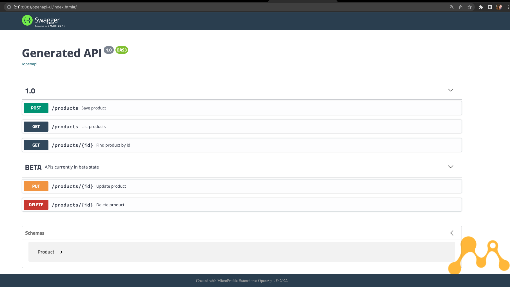

# Golden service apis for ACME Store       

In this exercise you can validate and practice your knowledge of the following concepts:

* Java microservice implementation with Helidon; 
* API designing to meet specific criteria;
* RESTful services implementation with JAX-RS;
* Extense API documentation with OpenAPI;
* In-memory persistence with MicroStream;
* Validation with Bean Validation;
* Implicit and constant usage of CDI;

Getting familiar with the use case and the exercise goals described next is highly recommended, as a detailed 
step-by-step guide is not provided. 

**Friendly advice**: consider leveraging this opportunity to 
upskill by making the best use of your knowledge and research skills to code the solution without replicating the 
provided solution.

## Scenario

Your consultancy was requested by the Acme Store company. The company's technical team wants to learn good 
practices and recommendations for Java microservices built on top of the building blocks offered by specifications. 
They demonstrate interest in validating the experience of delivering Microprofile on top of the Helidon 
runtime. 

Your task is to provide a Java backend service, with Helidon, to handle the basic operations of the store's products . 

### Goals

See below the solution's pre-requisites. (_Easily track your progress by marking tasks as "done"._)

- [ ] The service should be named `acme-store-rest`. It must rely on *Microprofile 3.3* and *Helidon*.
- The service handles operations for `Products` maintenance. A `Product` should have:
    - [ ] An ID, which is the `name`: mandatory and should be at max 100 chars.
    - [ ] A `description`:  mandatory, should have at least 5 chars
    - [ ] A `quantity`: mandatory and should be higher than 0. 
- The following operations for a `Product` should be available:
    - [ ] List all the products
    - [ ] Insert a new product
    - [ ] Retrieve a product by ID
    - [ ] Update a product based on its ID
    - [ ] Delete a product using its ID
- It should be a RESTful application. The urls should follow these rules:
    - [ ] To list all products:  GET "/products"
    - [ ] To insert a product: POST "/products" 
    - [ ] To find a product by ID: GET "/products/{productName}"
    - [ ] To delete a product: DELETE "/products/{productName}"
    - [ ] To update a product: PUT "/products/{productName}"
- The APIs should be properly documented:
  - [ ] All APIs should have documentation for the `Operation`, including `summary` and `description`;
  - [ ] The responses (`APIResponse`) should be documented according to potential results, with proper 
    `description` for returned HTTP codes (`responseCode`, e.g. 200, 404).
- The APIs should include information about release and stability through tags:
  - The following apis are part of the first release, and tagged (`@Tag`) as `1.0`:
    - [ ] List all
    - [ ] Find by ID
    - [ ] Save new product
  - These APIs are still in BETA phase, and are tagged (`@Tag`) as `BETA`:
    - [ ] Update 
    - [ ] Delete

### Expected results

The solution should look like this: 



<div class="video-wrapper">
  <iframe src="https://www.youtube.com/embed/O8aeDOkmYPw" frameborder="0" 
allowfullscreen></iframe>
</div>


## Hands-on guidance

To save your time, the customer's team has created a basic project using the [microprofile starter](https://start.
microprofile.io/). They have provided domain related objects and boilerplate code. If you 
prefer, you can also start a project from scratch and use the quickstart project in case you need to check 
dependencies configuration and such.

### The quickstart project: acme-store-rest

1. Get started by cloning the project to your machine (if you haven't already). 
```
git clone https://github.com/architects4j/helidon-microstream-training-labs-foundation
cd acme-store-rest
```
2. Open the project in your IDE of choice and give it an overall look. You can find multiple comments pointing to 
   code that needs adjustment.
3. If you are feeling confident, go ahead and get started with the requirements implementation. For general guidance, follow the next sections.

**Persistence**

The quickstart project is built on top of a ultra-fast in-memory persistence with [MicroStream](https://microstream.
one/). Learn more about this persistence option by checking the implementation of the `org.a4j.product.Inventory` class, enabled 
by the dependency `one.microstream:microstream-integrations-cdi:`.

### Implementing the solution 

#### REST Endpoints

The product's endpoints are partially implementated in the class `ProductResource`.  

4. Use a `ProductResource` to implement your REST APIs:
    1. **Scope:** An appropriate CDI scope should be set for this bean. The `@RequestScope` should be enough.
    2. **Path**: Remember to set the `javax.ws.rs.@Path` according to the goals of the project;
    3. **HTTP Methods**: To differentiate APIs and map incoming requests to http methods, annotate the methods with: 
       `@DELETE`, 
       `@PUT`, `@POST` and `@GET` from `javax.ws.rs`.
    4. **Custom paths**: To create an endpoint like `/products/{id}`, you can annotate a method with `@Path("{id}")` and 
       add `@pathParam` to the parameter. Example:

        ```java
        public Product findById(@PathParam("id")String id) {}
        ```
       
    5. **Exception Handling**: Avoid errors in case an invalid data is sent to your endpoints. 
       `WebApplicationException` can be used for this purpose. Example:
       ```java
        repository.findById(id).orElseThrow(() ->
            new WebApplicationException("There is no product with the id " +
                id, Response.Status.NOT_FOUND));
       ```
       
    6. **Responses with HTTP codes that make sense**: `Response.Status` provides a list of possibilities. Example:
       ```java
       return Response.status(Response.Status.CREATED)
                    .entity(repository.save(product))
                    .build();
       ```
       
### Field validation

To implement the business rules related to the product attributes, you can use Bean Validation annotations on your `Product.java`. 

1. The following dependency was already added to the project's `pom.xml`
```xml
<dependency>
    <groupId>org.glassfish.jersey.ext</groupId>
    <artifactId>jersey-bean-validation</artifactId>
</dependency>
```

2. In the class `Product.java`, use the multiple `javax.validation.constraints` options (like `@NotBlank`, 
   `@NotNull`, `@Size`). Configure each attribute's contraints accordingly along with the error message you 
   want to associate with it. Example: 
```java
    @NotBlank
    @Size(min = 3, max = 100, message = "The name size should be between 3 and 100 chars")
    private final String name;
```

3. In the `ProductResource.java` class, identify the methods where validation is needed, and use the `@Valid` 
   annotation for the parameters. Example:
```java
public Product update(@PathParam("id") String id, @Valid Product product) {
```

### APIs documentation with OpenAPI

#### Schema

The schema configuration can be done through annotations in the data objects, like `Product`. 

1. Notice the class schema is already configured. No extra changes are needed here:
```java
@Schema(name = "Product", description = "The entity that represents a product of acme store")
public class Product {
```
2. Configure the `@Schema` for all the attributes. Don't forget to add an `example` attribute.
3. Later on, we will use these configured schemas on the `ProductResource` OpenAPI configurations.

#### The endpoints

1. Configure the `@Tag` for each method as specified in the exercise goals. Example:
```java
@Tag(name = "BETA", description = "APIs currently in beta state")
```
2. For each method, configure the `@Operation` details with a `summary` and `description`;
3. For each method, specify possible responses with `@APIResponse`, setting the `responseCode` and the `description` 
   that explains what this response means. Example:
```java
@APIResponse(responseCode = "200", description = "Product successfully found")
```
4. Some `@APIResponse` might require extra information about the content being returned. This is where you can use 
   the schema we configured previously in the `Product` class. Example of an APIResponse for the findById operation:
```java
    @APIResponse(
            description = "The product",
            content = @Content(
                    mediaType = MediaType.APPLICATION_JSON,
                    schema = @Schema(implementation = Product.class)
            )
    )
```
5. Input parameters may also require API documentation. For example, when saving a product, we can inform the user 
   what is the expected input data by using the `@RequestBody` annotation, and the attributes `description` and 
   `content`. The `content` attribute points to our product schema. See an example below:
```java
    public Response insert(
            @RequestBody(
                    description = "The product", 
                    content = @Content(
                            mediaType = "application/json", 
                            schema = @Schema(implementation = Product.class)))
            @Valid Product product) {

```

### Running your application

* To test your application, you can package it with Maven, run with Java, and use the OpenAPI UI, Postman, curl, or 
  other tool of preference to invoke the rest APIs. 

* To package and run your application 
    * without Helidon CLI:
    ```shell
    mvn clean package
    java -jar target/acme-store-rest.jar
    ```
    * or, using Helidon CLI:
      ```shell
      helidon build
      helidon dev
      ```
    
* By default it will run on port 8081, as configured in the `microprofile-config.properties`. 
* Validate your APIs documentation with OpenAPI UI at: [http://localhost:8081/openapi-ui/]()
* Check the service implementation with the following request examples:
    * **Insert** a new product
    ```shell
    curl --location --request POST 'http://localhost:8081/products' \
    --header 'Content-Type: application/json' \
    --data-raw '{"name": "bottle", "description": "Can store cold and hot liquids.", "quantity": "2"}'
    ```
    * **List** all products
    ```shell
    curl --location --request GET 'http://localhost:8081/products'
    ```
    * **Search** a product by ID (name)
    ```shell
    curl --location --request GET 'http://localhost:8081/products/bottle'
    ```
    * **Update** a product using its ID (name)
    ```shell
    curl --location --request POST 'http://localhost:8081/products/bottle' \
    --header 'Content-Type: application/json' \
    --data-raw '{"name": "bottle", "description": "Can store ONLY cold liquids.", "quantity": "2"}'
    ```
    * **Delete** a product by ID (name)
    ```shell
    curl --location --request DELETE 'http://localhost:8081/products/bottle'
    ```

* The next step is to try data that actually breaks the business rules and validate if your application is validating 
for example, the required fields.
* If you can successfully execute the above items, it means you acomplished all this challenge goals!

!!! success "Congratulations!"

    You've finished your task for Acme Store with great success! You have created an examplar backend service that be used as a model, with good examples of usage of RESTFul concepts, beans validation, well-documented APIs, and much more! We're looking forward to seeing you upskilling by working on upcoming challenges!
