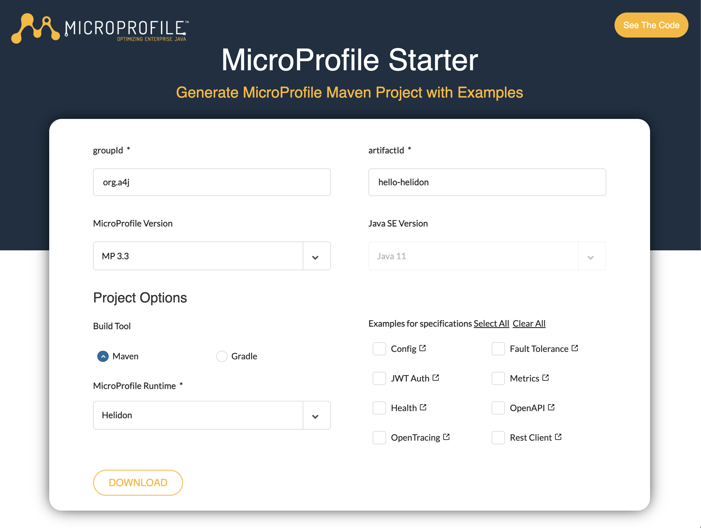

The microservices used in this workshop were generated using MicroProfile starter. If you want to create a new MicroProfile project, do the following:

1. Let's create a new project using MP Starter page. Access the page [https://start.microprofile.io/](https://start.microprofile.io/).
   

2. Use the following the data and click on download. You will get a zip file with an automatically generated project for you to get started.

   | Method      | Description                          |
         | ----------: | -----------------------------------: |
   | groupId       | org.a4j  |
   | artifactId       | hello-helidon |
   | MicroProfile Version    | 3.3 |
   | Build Tool | Maven | 
   | MicroProfile Runtime | Helidon | 


## Using Helidon CLI [Optional]

You can use Helidon CLI for executing tasks like creating new projects and using a feature called "Developer Loop". The Developer Loop allows you to leverage hot reload features while coding your helidon services.

1. Using a terminal, access your project's folder `hello-helidon`.
2. Run the app using the dev loop with:
    ```shell
    helidon dev
    ```
3. After the tool finishes downloading the artifacts, you should be able to see something like:
```shell
| downloading artifacts
| building
| build completed (1.9 seconds)
| hello-helidon starting

...

2022.05.27 22:59:32 INFO io.helidon.common.HelidonFeatures !thread!: Helidon MP 2.4.1 features: [CDI, Config, Fault Tolerance, Health, JAX-RS, Metrics, Open API, REST Client, Security, Server, Tracing]
```

    !!! Bug "Alert"
        Sometimes the dev loop might not work on the first initialization of helidon dev. To avoid issues, you can stop the service with ctrl+c (or cmd+c) and start it again with  `helidon dev`.

4. Open the service in your browser: [http://localhost:8080/data/hello](http://localhost:8080/data/hello)

5. On your IDE, open the class `org.a4j.hello.helidon.HelloController`
6. Change the endpoint path to `devloop` and the string returned by the method `sayHello` to `"Hello Dev Loop!"`
7. Back in your browser, check your changes reflected at [http://localhost:8080/data/devloop](http://localhost:8080/data/devloop)

## Additional information

When you are you GraalVM, you can compile your helidon services using Ahead of Time compilation. AoT is a strategy to have the compilation processing during build time, allowing you to create native executable files with fast startup time.

For more information check the [Helidon docs for Helidon SE GraalVM native image](https://helidon.io/docs/v2/#/se/aot/01_introduction). 
